# Bruno Salas Rodríguez

Estudiante de Ingeniería en Software en la UANL. Hago herramientas web, de datos y de automatización, y juegos en Godot.

[Portafolio](https://bruno-portfolio-azure.vercel.app) · [LinkedIn](https://www.linkedin.com/in/bruno-salas-969b78282/) · brunich99@gmail.com · Monterrey, México

> Software Engineering student at UANL. I build web, data and automation tools with React and TypeScript, and games in Godot. Every project below runs in the browser.

## Proyectos

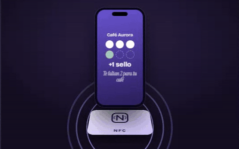

###  Chip NFC para negocios

Tarjeta de sellos y menú digital para restaurantes y negocios. 
El cliente acerca el celular al chip: sin app y sin registrarse.

[Probar](https://bruno-portfolio-azure.vercel.app/proyectos/club-nfc) · [Código](https://github.com/Brunich/Chip-NFC-Para-Empresas-Y-Negocios)

  

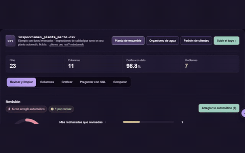

### 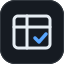 Analizador CSV

Revisa un CSV o Excel y encuentra duplicados, fechas mezcladas y reglas rotas. 
Arregla lo mecánico en un clic, lo grafica y lo consultas en SQL.

[Probar](https://bruno-portfolio-azure.vercel.app/proyectos/analizador-csv) · [Código](https://github.com/Brunich/Analizador-CSV)

  

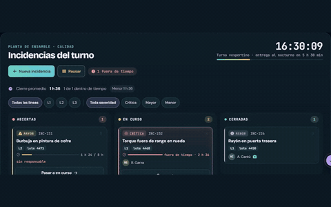

### 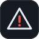 Tablero de incidencias

Incidencias de calidad que pasan de un turno al otro sin perderse. 
Cada una con responsable, evidencia, SLA por severidad y cierre.

[Probar](https://bruno-portfolio-azure.vercel.app/proyectos/entrega-de-turno) · [Código](https://github.com/Brunich/Tablero-De-Incidencias-De-Datos-Para-Empresas)

  

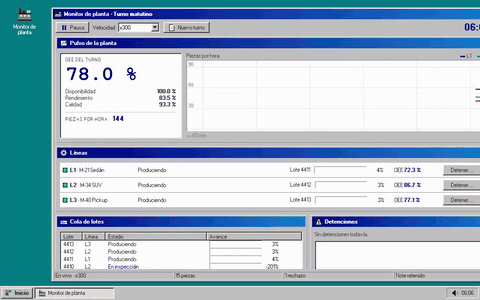

### 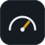 Monitor de planta

Tres líneas de producción en vivo, con estilo Windows 98. 
OEE, lotes y detenciones al momento, como en el piso de la planta.

[Probar](https://monitor-de-planta.vercel.app) · [Código](https://github.com/Brunich/Monitor-De-Planta)

  

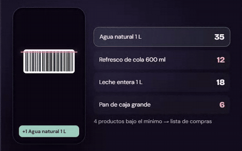

### 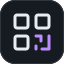 Inventario QR

La cámara del celular como lector de QR y códigos de barras. 
Entradas, ventas y conteo; avisa lo que falta y arma la lista de compras.

[Probar](https://bruno-portfolio-azure.vercel.app/proyectos/inventario) · [Código](https://github.com/Brunich/Inventario-QR-Con-Camara)

  

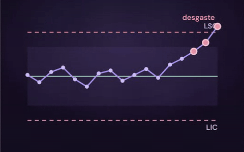

### 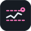 Gráficas de control

Gráficas X̄-R e I-MR a partir de las mediciones de una pieza. 
Marca las reglas de Western Electric y calcula Cp y Cpk contra la tolerancia.

[Probar](https://bruno-portfolio-azure.vercel.app/proyectos/graficas-de-control) · [Código](https://github.com/Brunich/Graficas-De-Control)

  

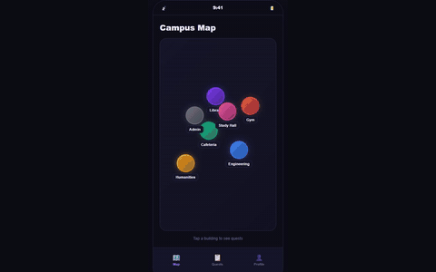

###  Punto U

Estudiantes de la UANL piden y hacen favores en un mapa del campus. 
App web y Android hecha con React y Capacitor.

  

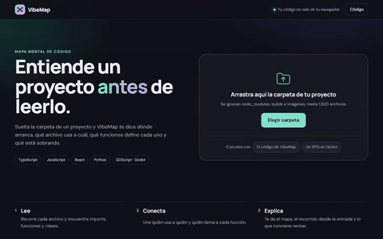

###  VibeMap

Sueltas la carpeta de un proyecto y la ves como mapa mental. 
Hecha en un hackathon con equipo de 3; tu código no sale del navegador.

[Código](https://github.com/Brunich/VibeMap)

  

## Juegos

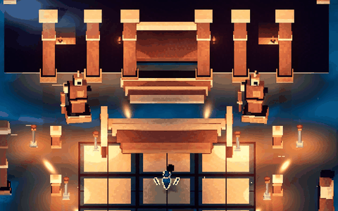

###  IA Rogue

Roguelike 3D en Godot 4 con tres cámaras y shaders propios. 
Un mismo personaje en pixel art, cel shading y 3D.

[Ver escenas](https://bruno-portfolio-azure.vercel.app/#graphics)

  

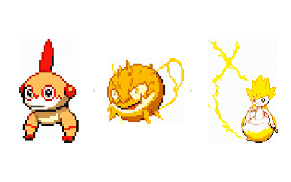

###  Nexos

RPG por turnos en Godot 4.6, con mapa abierto y batallas. 
Criaturas propias con tres fases de evolución.

[Código](https://github.com/Brunich/Nexos-Demo-Godot)

  

## Stack

TypeScript · React · Node.js · Supabase · Python · SQL · Playwright · three.js · Godot
