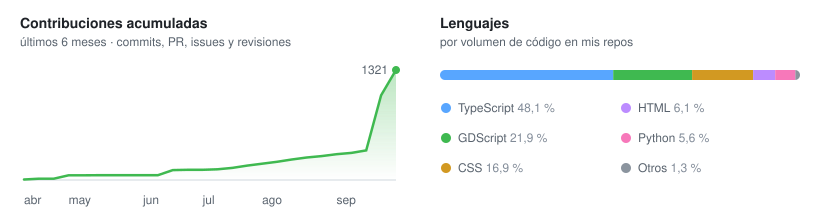

# Bruno Salas Rodríguez

Estudiante de Ingeniería en Software en la UANL. Hago herramientas web, de datos y de automatización, y juegos en Godot.

[Portafolio](https://bruno-portfolio-azure.vercel.app) · [LinkedIn](https://www.linkedin.com/in/bruno-salas-969b78282/) · brunich99@gmail.com · Monterrey, México

> Software Engineering student at UANL. I build web, data and automation tools with React and TypeScript, and games in Godot. Every project below runs in the browser.

## Proyectos

- **[Chip NFC para negocios](https://bruno-portfolio-azure.vercel.app/proyectos/club-nfc)**: tarjeta de sellos y menú digital sin app · [código](https://github.com/Brunich/Chip-NFC-Para-Empresas-Y-Negocios)
- **[Analizador CSV](https://bruno-portfolio-azure.vercel.app/proyectos/analizador-csv)**: encuentra y arregla errores en datos, con consultas SQL · [código](https://github.com/Brunich/Analizador-CSV)
- **[Tablero de incidencias](https://bruno-portfolio-azure.vercel.app/proyectos/entrega-de-turno)**: incidencias entre turnos con responsable y SLA · [código](https://github.com/Brunich/Tablero-De-Incidencias-De-Datos-Para-Empresas)
- **[Reportes OEE](https://bruno-portfolio-azure.vercel.app/proyectos/planta)**: OEE por línea a partir de producción, calidad y paros · [código](https://github.com/Brunich/Reportes-De-Produccion-OEE)
- **[Inventario QR](https://bruno-portfolio-azure.vercel.app/proyectos/inventario)**: la cámara del celular como lector de códigos · [código](https://github.com/Brunich/Inventario-QR-Con-Camara)
- **[Gráficas de control](https://bruno-portfolio-azure.vercel.app/proyectos/graficas-de-control)**: X̄-R, I-MR y Cp/Cpk desde un CSV o Excel · [código](https://github.com/Brunich/Graficas-De-Control)
- **[Punto U](https://punto-u-app.vercel.app)**: favores entre estudiantes en un mapa del campus · [código](https://github.com/Brunich/Punto-U-App)
- **[VibeMap](https://vibemap-brunich.vercel.app)**: un proyecto visto como mapa mental (hackathon) · [código](https://github.com/Brunich/VibeMap)

## Juegos

- **[IA Rogue](https://bruno-portfolio-azure.vercel.app/#graphics)**: roguelike 3D en Godot 4 con shaders propios
- **[Nexos](https://github.com/Brunich/Nexos-Demo-Godot)**: RPG por turnos, demo en Godot 4.6

## Stack

TypeScript · React · Node.js · Supabase · Python · SQL · Playwright · three.js · Godot
